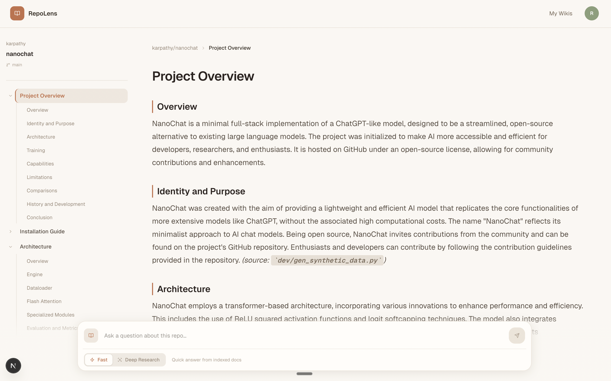
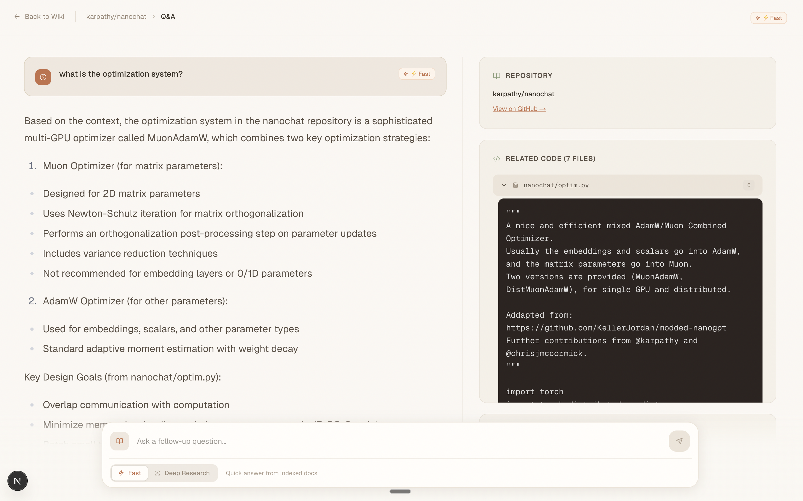

# RepoLens

> **Understand any GitHub repository in minutes — ask it questions, read its wiki, trace answers back to source.**

RepoLens is a production-style RAG application for exploring unfamiliar codebases. Paste a GitHub URL, and it clones the repo, indexes it into a vector store, auto-generates a navigable wiki, and lets you chat with the code — every answer grounded in real file paths and line-level snippets.

Built as an end-to-end system: a hybrid retrieval pipeline (dense + BM25 + cross-encoder rerank), a multi-step deep-research agent over LangGraph, and an automated LLM-as-judge evaluation harness wired to LangSmith.

---

## Screenshots

<!-- Drop screenshots into ./assets/ and update the paths below. -->

### Wiki view — auto-generated per repo


### Chat Q&A with source attribution


---

## Key Features

- **AI-powered repo Q&A** — ask questions in natural language and get source-grounded answers with clickable file references
- **Automatic wiki generation** — the system plans a page structure from the repo's file tree + README, then generates each page via RAG
- **Deep research mode** — a 3-step LangGraph agent (planner → update → synthesizer) for complex, cross-file architectural questions
- **Hybrid retrieval pipeline** — dense embeddings + BM25 fused via Reciprocal Rank Fusion, with optional cross-encoder reranking
- **LLM evaluation harness** — synthetic question generation across 6 categories, LLM-as-judge scoring on relevance, groundedness, and retrieval quality
- **Multi-provider LLM support** — Gemini, GPT-4o, Claude, Llama, Qwen via OpenRouter; per-request API key overrides
- **Streaming UI** — all generation endpoints stream tokens to the browser via `StreamingResponse` + `ReadableStream`
- **Wiki + conversation caching** — generated wikis and multi-turn chat history persist across sessions
- **Docker + Render deployment** — multi-stage Dockerfile with `render.yaml` for one-click cloud deploy

---

## Example

**Question**

> What is the architecture of this repository?

**RepoLens answer (abridged)**

> The backend is a FastAPI service that orchestrates a LangGraph RAG pipeline. Retrieval combines dense vector search (Qdrant) with BM25 sparse search, fused via RRF and optionally reranked with a cross-encoder. Wiki pages, chat history, and eval results are persisted in SQLite, while embeddings live in a per-repo Qdrant collection. The frontend is a Next.js app that streams tokens from the backend over `ReadableStream`.
>
> **Sources:** `api/graphs/rag_graph.py`, `api/nodes/retrieve.py`, `api/vectorstore.py`, `frontend/src/hooks/useStreamingContent.ts`

---

## How It Works

### 1. Repository indexing

1. Shallow-clone the repo (`git clone --depth 1`)
2. Walk files, skipping `node_modules`, `.git`, `__pycache__`, build artifacts
3. Filter oversized files (> 20k tokens for code, > 2k for docs)
4. Token-aware chunking — 350/100 overlap for code, 200/50 for docs
5. Embed chunks via OpenAI `text-embedding-3-small` or Google `gemini-embedding-001`
6. Persist to a per-repo Qdrant collection at `~/.repolens/qdrant/`

### 2. Retrieval pipeline

Three retrieval modes, switchable per request:

| Mode | Description |
|------|-------------|
| **Dense** | Vector similarity only |
| **Hybrid** | Dense + BM25, fused via Reciprocal Rank Fusion (k=60) |
| **Hybrid + Rerank** | Hybrid recall (top-20) → cross-encoder rerank → top-5 |

### 3. Wiki generation

- `POST /wiki/structure` — an LLM plans wiki pages from the file tree + README
- `POST /wiki/generate-page` — each page is generated via RAG and streamed to the client
- Pages cache to SQLite so revisits load instantly

### 4. Deep research mode

A LangGraph agent that runs three reasoning steps:

1. **Planner** — reads top-20 retrieved chunks, drafts an investigation strategy, emits a refined search query
2. **Update** — re-retrieves with the refined query, explores a new angle, may early-exit with `[RESEARCH_COMPLETE]`
3. **Synthesizer** — combines all accumulated notes into a final grounded answer

### 5. Evaluation pipeline

Automated RAG quality measurement wired to LangSmith:

- **Dataset generation** — LLM synthesizes questions across 6 categories: `direct`, `rephrased`, `conceptual`, `negative` (hallucination traps), `cross-file`, `keyword` (exact-identifier recall)
- **RAG execution** — each question is run end-to-end through the RAG graph
- **LLM-as-judge scoring** — three evaluators grade:
  - **Relevance** — does the answer address the question?
  - **Groundedness** — is every claim supported by retrieved context?
  - **Retrieval relevance** — did the retriever fetch useful chunks?
- Results persist in SQLite and are accessible via `/eval/results`

---

## Technical Highlights

Skills and engineering decisions demonstrated by this project:

- **Production-style RAG pipeline** with configurable retrieval modes and streaming responses
- **Hybrid search with RRF fusion** — combined dense embeddings and BM25 sparse scoring to improve recall
- **Cross-encoder reranking** (sentence-transformers) layered on top of hybrid recall to improve precision on top-k
- **Multi-step agentic reasoning** orchestrated with LangGraph (planner → update → synthesizer with early-exit)
- **LLM evaluation harness** — synthetic question generation + LLM-as-judge on 3 axes, integrated with LangSmith tracing
- **Multi-provider LLM abstraction** — unified factory over Gemini and OpenRouter-proxied models with per-request overrides
- **End-to-end streaming** — FastAPI `StreamingResponse` piped to a Next.js `ReadableStream` hook for token-by-token UI updates
- **Per-repo data isolation** — Qdrant collections, SQLite checkpoints, and wiki cache keyed by `owner/repo`
- **Deployable** — multi-stage Dockerfile and `render.yaml` for a reproducible cloud deploy

---

## Tech Stack

| Layer | Technology |
|-------|-----------|
| Frontend | Next.js 16 (TypeScript, React 19), Tailwind CSS v4 |
| Backend | FastAPI (Python 3.13+) |
| RAG Engine | LangGraph + LangChain |
| LLMs | Google Gemini (2.0 Flash, 2.5 Flash, 1.5 Pro), OpenRouter (GPT-4o, Claude Sonnet 4.5, Llama 3.3, Qwen 2.5) |
| Embeddings | OpenAI `text-embedding-3-small` / Google `gemini-embedding-001` |
| Sparse search | BM25 via `rank-bm25` |
| Reranking | Cross-encoder via `sentence-transformers` |
| Vector store | Qdrant (local file mode) |
| Evaluation | LangSmith + LLM-as-judge |
| Conversation memory | LangGraph SQLite checkpointer |
| Wiki & eval cache | SQLite |
| Deploy | Docker + Render.com |

---

## System Architecture

<!-- Add an architecture diagram at ./assets/architecture.png -->


```
User ──► Next.js frontend ──► FastAPI backend ──► LangGraph graphs
                                                   ├─► Retrieve (dense / BM25 / rerank)
                                                   ├─► Format context
                                                   └─► Generate (LLM, streaming)
                                                          │
                                  ┌───────────────────────┼───────────────────────┐
                                  ▼                       ▼                       ▼
                             Qdrant (vectors)      SQLite (checkpoints,      LangSmith
                                                    wiki + eval cache)       (tracing + eval)
```

---

## Project Structure

```
RepoLens/
├── api/
│   ├── api.py                  # FastAPI routes
│   ├── data_pipeline.py        # Cloning + chunking
│   ├── vectorstore.py          # Qdrant management
│   ├── llm.py                  # Multi-provider LLM factory
│   ├── embedder.py             # Embedding factory
│   ├── reranker.py             # Cross-encoder reranker
│   ├── graphs/                 # LangGraph builders (RAG, wiki, deep research)
│   ├── nodes/                  # Retrieval, context formatting, generation, research
│   └── eval/                   # Dataset gen, runner, evaluators, cache
├── frontend/
│   └── src/
│       ├── app/                # Next.js routes (home, wiki viewer)
│       ├── components/         # Ask, Markdown, WikiTreeView, ApiKeysModal, ...
│       └── hooks/              # useStreamingContent
├── Dockerfile
└── render.yaml
```

---

## Getting Started

### Prerequisites

- Python 3.13+
- Node.js 18+
- [`uv`](https://docs.astral.sh/uv/) Python package manager
- `OPENAI_API_KEY` — used by the default embedder
- `GOOGLE_API_KEY` — for Gemini LLMs and/or Google embeddings
- `OPENROUTER_API_KEY` (optional) — for OpenRouter-proxied models
- `LANGSMITH_API_KEY` (optional) — for eval tracing

### Setup

```bash
git clone https://github.com/your-username/RepoLens.git
cd RepoLens
cp .env.example .env            # then fill in API keys
uv sync                          # backend deps
cd frontend && npm install       # frontend deps
```

### Run

Backend (port 8002):

```bash
uv run uvicorn api.api:app --host 0.0.0.0 --port 8002 --reload
```

Frontend (port 3000):

```bash
cd frontend && npm run dev
```

Then open [http://localhost:3000](http://localhost:3000).

### Docker

```bash
docker build -t repolens .
docker run -p 8002:8002 \
  -e GOOGLE_API_KEY=... \
  -e OPENAI_API_KEY=... \
  -v ~/.repolens:/root/.repolens \
  repolens
```

---

## API Endpoints

| Endpoint | Method | Description |
|----------|--------|-------------|
| `/health` | GET | Health check |
| `/models/config` | GET | Available LLM providers and models |
| `/lang/config` | GET | Supported output languages |
| `/wiki/structure` | POST | Plan wiki pages for a repo |
| `/wiki/generate-page` | POST | Generate a wiki page (streaming) |
| `/wiki/cache` | GET/POST/DELETE | Fetch, save, or clear cached wiki |
| `/api/processed_projects` | GET | List all cached wikis |
| `/chat/stream` | POST | Multi-turn RAG chat (streaming) |
| `/chat/deep-research` | POST | Deep research agent (streaming) |
| `/eval/run` | POST | Run eval pipeline for a repo |
| `/eval/results` | GET | Fetch most recent eval results |

---

## Data Persistence

```
~/.repolens/
├── qdrant/          # Vector embeddings per repo
├── checkpoints.db   # Conversation history (LangGraph)
└── wiki_cache.db    # Generated wikis + eval results
```

---

## Deployment

The included `render.yaml` provisions a Docker-based web service on Render.com with:

- Health check at `/health`
- 10 GB persistent disk mounted at `/root/.repolens` (Qdrant + SQLite)
- Environment variables for API keys and CORS origins

---

## Motivation

Onboarding onto an unfamiliar codebase is slow and frustrating — skim the README, click through folders, grep for keywords, piece together a mental model. RepoLens compresses that loop by combining retrieval, reasoning, and documentation generation into a single tool, and by grounding every answer in real source code so you can trust what you read.

---

## License

MIT
